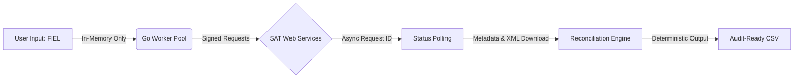

# SAT Fiscal Reconciliation Engine (Go)


**High-concurrency fiscal metadata retrieval and reconciliation engine for SAT (Mexico).**

Designed to operate where **data integrity, auditability, and operational risk** matter more than speed-to-demo.

Built by **Irene Olguin**
*Senior Software Engineer – Backend, Data Integrity & Compliance Systems*

---

## 🎯 Context & Problem Statement

In regulated environments, reconciliation failures are rarely technical — they are **visibility problems**.

Common failure modes:
- Partial or delayed fiscal data retrieved from SAT.
- Silent mismatches between ERP records and authoritative sources.
- Manual reconciliation pipelines (Excel-based) with no audit trail.
- Systems optimized for delivery speed, not regulatory scrutiny.

This project addresses those gaps by providing a **deterministic, traceable, read-only reconciliation engine**, designed to surface discrepancies without mutating or hiding data.

---

## 🏗 Architecture & Technical Decisions

This is not a wrapper nor a PAC substitute.
It is a **specialized backend engine** optimized for correctness under load.

### Core Design Principles

- **Language: Go (Golang)**
  Chosen for native concurrency, memory safety, and predictable performance.

- **Stateless / Zero-Trust Execution**
  - No persistent storage of FIEL or CSD credentials.
  - All cryptographic material lives only in volatile memory.
  - Designed for local execution or controlled environments.

- **Read-Only by Design**
  - No destructive operations.
  - No data mutation.
  - Suitable for audit, verification, and forensic reconciliation.

- **Hybrid Embedded Storage**
  - SQLite / BadgerDB for local persistence.
  - Flexible handling of SAT adendas via JSON structures.
  - XML compression reducing storage footprint ~60%.

- **Operational Resilience**
  - Chunked asynchronous downloads to mitigate SAT rate limits.
  - Explicit handling of known SAT service errors (e.g. Error 5003).

---

## 🔄 Processing Pipeline



---

## 🛡 Design Philosophy

This project reflects how I work in production environments:

* **Systems must be auditable.**
* **Decisions must be explainable.**
* **Data discrepancies must be visible, not hidden.**
* **Compliance is not a blocker — it is a design constraint.**

**What this project is NOT:**

* Not a billing system (PAC).
* Not a tax optimization tool.
* Not a data harvesting platform.

---

## 🚀 Usage (Local Execution)

```bash
# Clone the repository
git clone [https://github.com/TU-USUARIO/sat-reconciler.git](https://github.com/i4ene0lguin/sat-reconciler)
cd sat-reconciler

# Build with metadata injection
go build -ldflags "-X main.Version=1.0.0" -o conciliador

# Run
./conciliador

```

*Designed to run locally. Fiscal data never leaves the execution environment.*

---

## 👩‍💻 About the Author

I specialize in stabilizing high-risk backend systems.

* **Background:** Backend Engineering, Financial Systems, Compliance-heavy environments.
* **Focus:** Data Integrity, Traceability, Operational Resilience.
* **Approach:** Documented decisions, deterministic behavior, minimal magic.

*This repository is a portfolio project demonstrating architectural patterns used in regulated production systems.*
