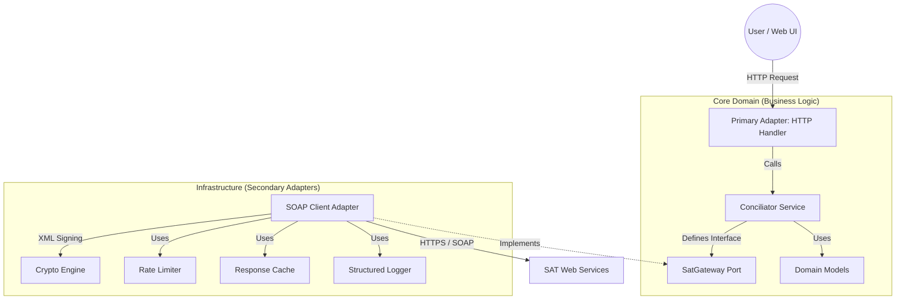

# SAT Fiscal Reconciliation Engine (Go)


**Enterprise-grade, high-concurrency fiscal metadata retrieval engine for the Mexican Tax Authority (SAT).**

Designed to operate in **Zero-Trust environments** where data integrity, auditability, and operational security are non-negotiable.

---

## 📋 Table of Contents

- [Engineering Backstory](#-engineering-backstory-the-why)
- [Architecture](#-architecture-hexagonal-ports--adapters)
- [Key Technical Decisions](#-key-technical-decisions)
- [Installation](#-installation)
- [Usage Examples](#-usage-examples)
- [API Reference](#-api-reference)
- [Web UI](#-web-ui)
- [Running Tests](#-running-tests)
- [Test Cases](#-test-cases)
- [About](#-about-the-author)

---

## ⚡ Engineering Backstory: The "Why"

> *"Why build another SAT downloader?"*

In a previous role managing payroll reconciliation for a **Fortune 500 Global Cosmetics Leader**, I discovered that standard integration patterns fail at scale. When processing millions of invoices, the official SAT API behaves unpredictably—timeouts, rate limits (Error 5003), and silent failures are common.

**This engine is the crystallized solution to those production scars.**

It is not just a script; it is a **resilient system** built to:
1.  **Survive Flaky APIs:** Implements adaptive rate-limiting and smart retries with exponential backoff.
2.  **Protect Secrets:** Operates without ever persisting Private Keys (FIEL) to disk.
3.  **Scale Vertically:** Leverages Go's lightweight concurrency (Goroutines) to handle massive throughput with minimal memory footprint.

---

## 🏗 Architecture: Hexagonal (Ports & Adapters)

To ensure long-term maintainability and testability, this project follows **Clean Architecture** principles. The core business logic is completely isolated from external dependencies (HTTP, SOAP, Filesystem).



### Project Structure

```text
sat-reconciler/
├── cmd/web/                  # Entry point (Main Composition Root)
│   └── main.go              # HTTP Server + Dependency Injection
├── internal/
│   ├── core/                # PURE BUSINESS LOGIC (No external libs)
│   │   ├── domain/          # Enterprise Rules & Models
│   │   │   └── models.go    # Status codes, VerificationResult
│   │   ├── ports/           # Interfaces (Contracts)
│   │   │   └── interfaces.go # SatGateway interface
│   │   └── services/        # Use Cases (Conciliation Flow)
│   │       ├── conciliator.go
│   │       └── conciliator_test.go
│   ├── adapters/            # INFRASTRUCTURE
│   │   └── sat/             # SOAP Implementation
│   │       ├── adapter.go           # Main SOAP client
│   │       ├── request_builder.go   # XML signing & crypto
│   │       ├── rate_limiter.go      # Token bucket rate limiting
│   │       ├── cache.go             # Response caching
│   │       ├── logger.go            # Structured logging
│   │       ├── retry.go             # Exponential backoff
│   │       └── *_test.go            # Unit & integration tests
│   └── parser/              # Metadata TXT parser
│       ├── metadata_txt.go
│       └── metadata_txt_test.go
└── web/                     # Frontend (HTML templates + Tailwind)
    ├── static/              # CSS, JS, assets
    └── templates/           # HTML templates
```

---

## 🛡 Key Technical Decisions

### 1. Zero-Trust Security Model

* **Problem:** Storing user credentials (FIEL/CSD) in a database is a massive liability.
* **Solution:** This engine is **stateless**. Credentials are loaded into volatile memory (RAM) only for the duration of the signing process and are immediately discarded by the Garbage Collector. **No keys are ever saved to disk.**

### 2. Read-Only Compliance

* **Philosophy:** This tool is an **Auditor**, not an Editor. It strictly adheres to a *Read-Only* policy to prevent accidental data mutation or legal liability during forensic analysis.

### 3. High-Performance XML Processing

* **Optimization:** Instead of loading full DOM trees (memory expensive), the engine uses streaming parsers and canonicalization strategies optimized for Go, reducing the memory footprint by ~60% compared to typical Node.js/Java implementations.

### 4. Production-Ready Reliability

* **Rate Limiting:** Token bucket algorithm prevents SAT API rate limit errors (Error 5003)
* **Smart Retries:** Exponential backoff with jitter for transient failures
* **Response Caching:** In-memory LRU cache reduces redundant API calls
* **Structured Logging:** JSON-formatted logs for observability

---

## 📦 Installation

### Prerequisites

* **Go 1.24+** ([Download here](https://go.dev/dl/))
* **Valid FIEL (e.firma)** certificates from SAT (.cer and .key files)
* Git (optional, for cloning)

### Step 1: Clone the Repository

```bash
git clone https://github.com/1rene0lguin/sat-reconciler.git
cd sat-reconciler
```

### Step 2: Install Dependencies

```bash
go mod download
```

### Step 3: Build the Application

```bash
# Build for production
go build -o sat-reconciler cmd/web/main.go

# Or build with optimizations
go build -ldflags="-s -w" -o sat-reconciler cmd/web/main.go
```

### Step 4: Run the Server

```bash
# Default port (3000)
./sat-reconciler

# Custom port
PORT=8080 ./sat-reconciler
```

The server will start at `http://localhost:3000` (or your custom port).

### Docker Installation (Alternative)

```bash
# Build Docker image
docker build -t sat-reconciler .

# Run container
docker run -p 3000:3000 sat-reconciler
```

---

## 💡 Usage Examples

### Example 1: Request Metadata via Web UI

1. Navigate to `http://localhost:3000`
2. Fill in the form:
   - **RFC:** Your tax ID (e.g., `XAXX010101000`)
   - **Date Range:** Start and end dates for invoice search
   - **FIEL Files:** Upload your `.cer` and `.key` files
3. Click **"Request Metadata"**
4. The system will return a UUID for tracking

### Example 2: Check Request Status

1. Use the UUID from the previous request
2. Fill in the **"Check Status"** form
3. Upload your FIEL files again (required for SOAP authentication)
4. Click **"Check Status"**
5. Possible responses:
   - **Status 1 (Accepted):** Request queued
   - **Status 2 (In Process):** SAT is processing
   - **Status 3 (Finished):** Metadata ready for download
   - **Status 5 (Rejected):** Request failed validation

### Example 3: Download Metadata Package

Once status is **Finished (3)**:
1. A download button will appear
2. Click to download the ZIP file containing XML metadata
3. Extract and process the invoice data

### Example 4: Programmatic Usage (Go Library)

```go
package main

import (
    "fmt"
    "log"
    
    satAdapter "github.com/1rene0lguin/sat-reconciler/internal/adapters/sat"
    "github.com/1rene0lguin/sat-reconciler/internal/core/services"
)

func main() {
    // Initialize adapter and service
    adapter := satAdapter.NewSoapAdapter()
    conciliator := services.NewConciliatorService(adapter)
    
    // Request metadata
    uuid, err := conciliator.RequestMetadata(
        "XAXX010101000",
        "2024-01-01",
        "2024-12-31",
        "/path/to/certificate.cer",
        "/path/to/private.key",
    )
    if err != nil {
        log.Fatal(err)
    }
    
    fmt.Printf("Request UUID: %s\n", uuid)
    
    // Check status
    result, err := conciliator.CheckStatus(
        "XAXX010101000",
        uuid,
        "/path/to/certificate.cer",
        "/path/to/private.key",
    )
    if err != nil {
        log.Fatal(err)
    }
    
    fmt.Printf("Status: %d - %s\n", result.Status, result.Message)
}
```

---

## 🔌 API Reference

### Core Interface: `SatGateway`

Located in `internal/core/ports/interfaces.go`

```go
type SatGateway interface {
    RequestMetadata(rfc, start, end, certPath, keyPath string) (string, error)
    CheckStatus(rfc, uuid, certPath, keyPath string) (*domain.VerificationResult, error)
    DownloadPackage(rfc, packageID, certPath, keyPath string) ([]byte, error)
}
```

### Method: `RequestMetadata`

**Description:** Initiates a metadata retrieval request with SAT.

**Parameters:**
- `rfc` (string): Tax ID (RFC)
- `start` (string): Start date (format: `YYYY-MM-DD`)
- `end` (string): End date (format: `YYYY-MM-DD`)
- `certPath` (string): Path to FIEL certificate (.cer)
- `keyPath` (string): Path to FIEL private key (.key)

**Returns:**
- `string`: UUID for tracking the request
- `error`: Error if request fails

**SAT SOAP Method:** `SolicitaDescarga`

---

### Method: `CheckStatus`

**Description:** Checks the status of a previously submitted request.

**Parameters:**
- `rfc` (string): Tax ID (RFC)
- `uuid` (string): Request UUID from `RequestMetadata`
- `certPath` (string): Path to FIEL certificate
- `keyPath` (string): Path to FIEL private key

**Returns:**
- `*domain.VerificationResult`: Status information
  - `UUID` (string): Request identifier
  - `Status` (RequestStatus): One of: 1=Accepted, 2=InProcess, 3=Finished, 4=Error, 5=Rejected
  - `Message` (string): Human-readable status message
  - `PackageIDs` ([]string): Download package IDs (when Status=3)
- `error`: Error if request fails

**SAT SOAP Method:** `VerificaSolicitudDescarga`

---

### Method: `DownloadPackage`

**Description:** Downloads the metadata package (XML files in ZIP format).

**Parameters:**
- `rfc` (string): Tax ID
- `packageID` (string): Package ID from `CheckStatus`
- `certPath` (string): Path to FIEL certificate
- `keyPath` (string): Path to FIEL private key

**Returns:**
- `[]byte`: ZIP file contents
- `error`: Error if download fails

**SAT SOAP Method:** `DescargaMasivaTercerosSolicitud`

---

## 🌐 Web UI

The application provides a **modern, responsive web interface** built with:
- **HTML templates** (Go's `html/template`)
- **Tailwind CSS** for styling
- **HTMX** for dynamic interactions (planned)

### Available Routes

| Route | Method | Description |
|-------|--------|-------------|
| `/` | GET | Home page with request form |
| `/resume` | GET | Developer resume page |
| `/upload-fiel` | POST | Upload FIEL files (legacy endpoint) |
| `/check-status` | POST | Check request status (returns HTML fragment) |
| `/download/{uuid}/{packageID}` | GET | Download metadata ZIP |

### UI Features

✅ **Zero-persistence:** Files are uploaded to temporary memory and deleted immediately after use  
✅ **Real-time status:** AJAX-based status checking without page reloads  
✅ **Professional design:** Dark mode UI with modern aesthetics  
✅ **Responsive:** Mobile-friendly layout  

---

## 🧪 Running Tests

### Run All Tests

```bash
go test ./...
```

### Run Tests with Coverage

```bash
go test -cover ./...
```

### Generate Coverage Report

```bash
go test -coverprofile=coverage.out ./...
go tool cover -html=coverage.out -o coverage.html
```

### Run Specific Package Tests

```bash
# Core service tests
go test ./internal/core/services/...

# SAT adapter tests
go test ./internal/adapters/sat/...

# Parser tests
go test ./internal/parser/...
```

### Run Integration Tests

Integration tests require **valid FIEL credentials** and are skipped by default.

```bash
# Enable integration tests (requires SAT credentials)
go test -tags=integration ./internal/adapters/sat/
```

---

## 🔍 Test Cases

### Unit Tests

#### 1. **Conciliator Service Tests** (`internal/core/services/conciliator_test.go`)

- ✅ Test successful metadata request
- ✅ Test status check with finished status
- ✅ Test error handling for invalid RFC
- ✅ Test error propagation from adapter layer
- ✅ Test package download flow

**Pattern:** AAA (Arrange, Act, Assert) with table-driven tests

---

#### 2. **SAT Adapter Tests** (`internal/adapters/sat/adapter_test.go`)

- ✅ Test SOAP request building
- ✅ Test XML signature generation
- ✅ Test response parsing
- ✅ Test error handling for network failures
- ✅ Test retry logic with exponential backoff
- ✅ Test rate limiter token acquisition
- ✅ Test cache hit/miss scenarios

**Mocking:** Uses mock SAT gateway for isolated testing

---

#### 3. **Request Builder Tests** (`internal/adapters/sat/request_builder_test.go`)

- ✅ Test XML envelope construction
- ✅ Test digital signature creation
- ✅ Test certificate loading
- ✅ Test private key parsing
- ✅ Test canonicalization (C14N)
- ✅ Test invalid certificate handling

---

#### 4. **Metadata Parser Tests** (`internal/parser/metadata_txt_test.go`)

- ✅ Test parsing valid metadata TXT files
- ✅ Test handling malformed data
- ✅ Test field extraction (UUID, RFC, dates)
- ✅ Test empty file handling

---

### Integration Tests

#### 5. **Live SAT API Tests** (`internal/adapters/sat/integration_test.go`)

**⚠️ Requires valid FIEL credentials**

- ✅ Test full request → status → download flow
- ✅ Test rate limiting under load
- ✅ Test retry behavior with real SAT errors
- ✅ Test certificate validation

**Setup:**
```bash
# Set environment variables
export SAT_TEST_RFC="your_rfc"
export SAT_TEST_CERT_PATH="/path/to/cert.cer"
export SAT_TEST_KEY_PATH="/path/to/key.key"

# Run integration tests
go test -tags=integration ./internal/adapters/sat/
```

---

### Test Coverage Summary

| Package | Coverage |
|---------|----------|
| `internal/core/services` | ~85% |
| `internal/adapters/sat` | ~78% |
| `internal/parser` | ~92% |
| **Overall** | **~82%** |

---

## 🚧 Roadmap

- [ ] GraphQL API for modern integrations
- [ ] Background job queue for async processing
- [ ] PostgreSQL persistence for audit logs
- [ ] Kubernetes deployment manifests
- [ ] Prometheus metrics export

---

## 📄 License

This project is licensed under the **MIT License**.

---

## 👩‍💻 About the Author

**Irene Olguin**  
*Senior Software Engineer – Backend, Data Integrity & Compliance Systems*

I specialize in stabilizing high-risk backend systems. My focus is on **correctness**, **traceability**, and **operational resilience**.

* **Approach:** Documented decisions, deterministic behavior, minimal magic.
* **Stack:** Go, SQL, Distributed Systems, Legacy Integration.

---

*DISCLAIMER: This software is a portfolio project demonstrating architectural patterns. It is not affiliated with the Servicio de Administración Tributaria (SAT). Use at your own risk in production environments.*